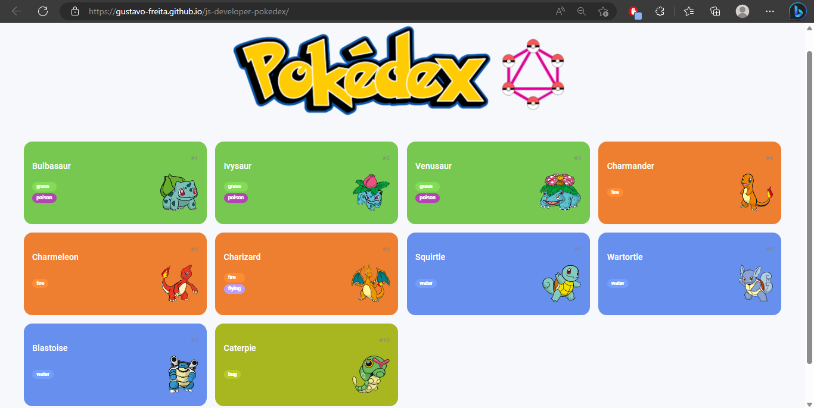
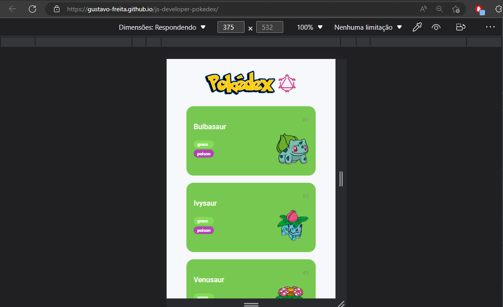
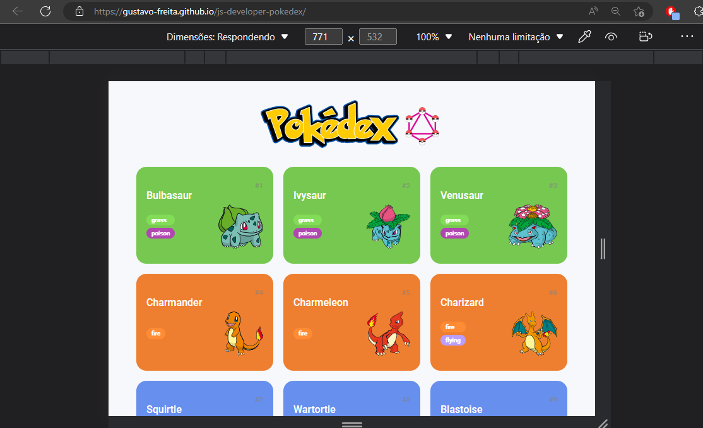

# <h1 align="center"><a href="https://gustavo-freita.github.io/js-developer-pokedex/">Pokedex</a></h1>

## Descrição do Projeto:

Esse projeto foi desenvolvimento para aumentar os meus conhecimentos e capacidade no consumo de uma API. Esse projeto foi criado a partir do conceito Mobile First, mas focado no focado o desenvolvimento do JavaScript.

## Project Description:

This project was developed to increase my knowledge and ability to consume an API. This project was created with Mobile First, but focused on JavaScript development.

<h2 align="center">

</h2>

<h3 align="center">
  
  
  
</h3>

### 🛠 Tecnologias / Technologies

As seguintes ferramentas foram usadas na construção do projeto / The following tools were used in building the project:

- [HTML](https://www.w3schools.com/html/)
- [CSS](https://www.w3schools.com/Css/)
- [JavaScript](https://developer.mozilla.org/en-US/docs/Web/JavaScript/Guide/Introduction)
- [PokeAPI](https://pokeapi.co/?ref=public-apis)

<h2>:hammer: Créditos</h2>

Web Page feito por / Web Page made by:

<a href="https://github.com/gustavo-freita">Gustavo Freitas</a> <a href="https://github.com/gustavo-freita">
